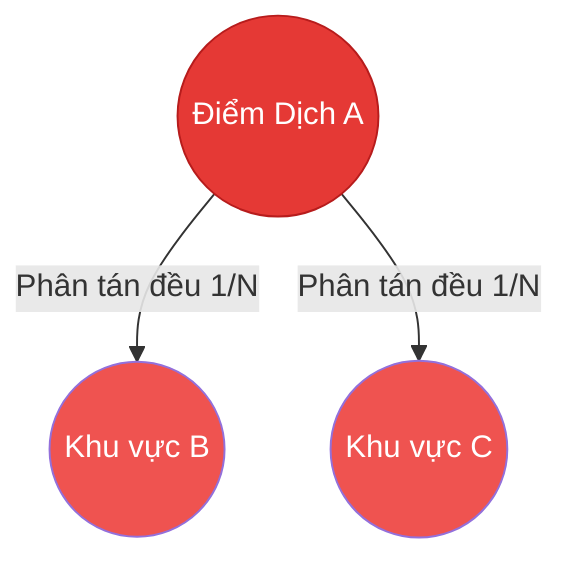
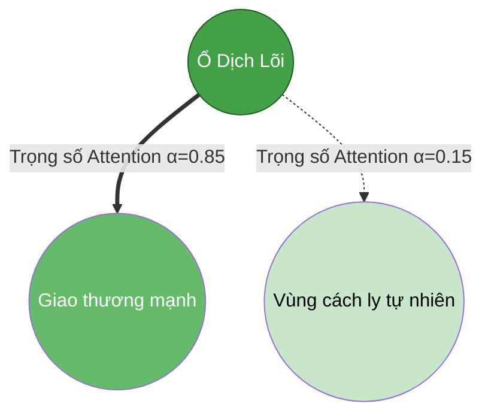
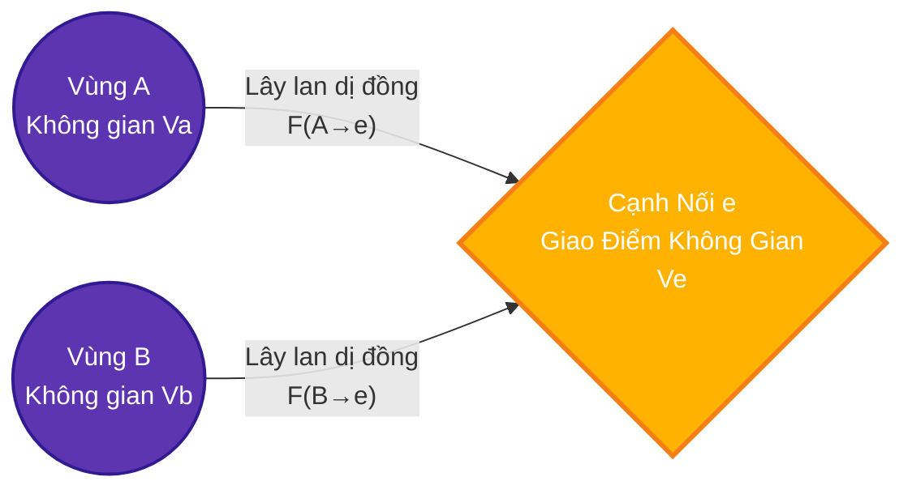
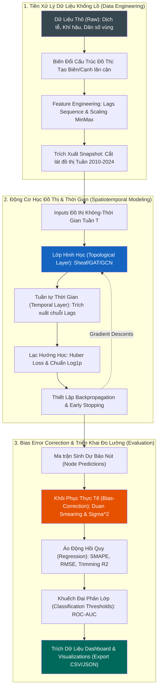

<h1 align="center">🦟 Tận Dụng Sức Mạnh Đại Số Topo Trong Dự Báo Sự Bùng Phát Sốt Xuất Huyết Bằng Sheaf Attention Networks</h1>

<p align="center">
  
  
  
  
</p>

---

## 📖 Bối Cảnh Nghiên Cứu (Research Overview)

Nghiên cứu khoa học này đề xuất một **hệ khung dự báo không gian - thời gian (spatiotemporal framework)** ở cấp độ đô thị (municipality) để theo dõi dịch sốt xuất huyết tại Brazil. Thay vì các mô hình Time-Series cổ điển, dự án tiên phong khai thác **Học Đồ Thị Topo (Topological Graph Learning)** để xử lý những cản trở cực kỳ phức tạp về địa lý và thời tiết.

Dữ liệu lịch sử khổng lồ bao trọn giai đoạn **2010–2024**, hợp nhất 14 đặc trưng đa nguồn (dịch tễ, mức độ mưa, biến động nhiệt độ, phân luồng dân số). Cấu trúc dữ liệu liên tục được ánh xạ thành các **Weekly Graph Snapshots (Bức tranh đồ thị hàng tuần)**. Nhãn dự báo trải qua biến đổi cấu trúc $log1p$ nhằm triệt tiêu tối đa sự sai lệch phân phối (distribution skew) trước khi dùng hàm mất mát tối ưu Huber Loss.

---

## 🔬 Benchmark Lõi: 5 Thể Hệ GNN (The Five Core GNN Variants)

Dự án đánh giá độ hiệu quả vượt trội (benchmark) thông qua **5 kiến trúc mạng học sâu** từ cơ bản đến nâng cao. Mỗi kiến trúc đảm nhiệm năng lực phân giải hình học đồ thị khác nhau.

### 1. Simple GNN (Baseline Spatial)
Mô hình cơ bản nhất, dùng Message Passing thông thường. Hoạt động trên lý thuyết quy tụ tối giản, giả định dịch lây lan theo đồ thị đồng chất không có vật cản. 
`File: models/simple_gnn.py | Arg: --model gnn`

### 2. Graph Convolutional Networks (GCN)
Kế thừa học thuyết **Homophily** (Đồng chất). GCN áp dụng phân tích vi phân dải phổ (spectral filtering).
Nó coi mức độ đe dọa lây nhiễm từ Đô thị A lên các hàng xóm là **tuyệt đối như nhau**.
`File: models/gcn_model.py | Arg: --model gcn`



### 3. Spatial-Temporal Graph Attention Networks (ST-GAT)
Đột phá với hệ thống **Self-Attention**. ST-GAT liên tục quan sát chuỗi đồ thị thời gian thực để học ra cơ chế lây lan ưu tiên thông qua hệ số $\alpha$.
`File: models/temporal_gat.py | Arg: --model gat`



### 4. Nền tảng Topological Sheaf (Sheaf Baseline) & Nhánh 5. Sheaf Connection (Sheaf_Conn)
Bước nhảy vào kỷ nguyên Đại Số Topo học (Algebraic Topology). Rũ bỏ giả định Homophily, mạng lưới đồ thị dịch tễ bị dị cấu trúc mạnh (Heterophily) do cản trở địa lý, lưu lượng di chuyển... Mô hình tạo ra các **Vector Spaces** cho từng đỉnh, ánh xạ lên cạnh qua toán tử Sheaf Laplacian độc quyền. `Arg: --model sheaf | --model sheaf_conn`

Tóm tắt sự ưu việt: Học các ma trận **Restriction Maps** $F(A \to e)$ cực kì phức tạp trên từng rìa đồ thị. Nó phản ánh độ trễ **bất đối xứng hoàn hảo**. Đi lại từ A qua B rất dễ khiến dịch lan mạnh, nhưng ngược lại B về A thì không.



---

## 🗃️ Quy Trình Tổng Thể Đặc Chuẩn Data Scientist (End-to-End Pipeline Workflow)

Thiết kế kiến trúc vòng đời mô hình dựa trên quy chuẩn **Data Science chuyên nghiệp**, đi sâu từng module vật lý thực thụ bên trong hệ thống dự án.



<br>

## 🚀 Khởi Chạy Dự Án

### 💻 Setup Môi Trường
```bash
git clone https://github.com/danielhuynh-04/Sheaf-Attention-Networks-in-forecasting-Dengue-fever-in-Brazil.git
cd Sheaf-Attention-Networks-in-forecasting-Dengue-fever-in-Brazil
pip install -r requirements.txt 
```
*(Nếu thiết lập bị thiếu, yêu cầu chuẩn: `torch`, `pytorch-geometric`, `pandas`, `numpy`, `scikit-learn`)*

### 🧠 Vận Hành Quá Trình Training Kép (Dual Run Protocol)
Kiến trúc khởi xướng qua file trung tâm định tuyến `run_global_gat.py`:

```bash
# Huấn luyện Sheaf_Connection tiên tiến nhất
python run_global_gat.py --model sheaf_conn --epochs 200

# So sánh tương đương với Baseline GCN
python run_global_gat.py --model gcn --epochs 200
```

> **Lệnh Tuân thủ CLI:**
> - `--model`: Cơ sở so khớp `[gnn, gcn, gat, sheaf, sheaf_conn]`
> - `--epochs`: Giới hạn hội tụ.
> - `--eval_only`: Nhúng giá trị `1` sẽ skip qua trình training, lấy checkpoint tĩnh hội tụ `.pt`.
> - `--export_predictions`: Nhúng `1` giải phóng ma trận dữ liệu phân tích từng micro-vùng làm ảnh (đầu ra `Visualizations`).

<br>

## 📊 Phương Pháp Đánh Giá Mở Rộng
Báo cáo mô hình không chỉ giới hạn tại phương sai Regression.
Dự án được đánh giá cực nghiêm ngặt:
- **Regression:** `MAE`, `RMSE`, `SMAPE`, đặc biệt là sự tương quan `R2_log` cắt tỉa các Outlier phân vị 99%.
- **Classification Projection:** Điểm chuẩn bùng nổ ROC-AUC và PR-AUC biên dịch chéo từ hồi quy thực tế.

Tất cả Dashboard, Checkpoints rễ sẽ được đổ vào `data/interim/` sau mỗi lần Run thành công.

---
> 💡 **Notice from the Author**: Các phân vùng chứa Dataset khổng lồ thô bạo (Data, Visualizations, Checkpoints) cũng như bản báo cáo NCKH toàn vẹn (.docx) đã được bảo vệ mã hóa ẩn danh `.gitignore` khởi cục bộ trong Repository Open-Source này để tăng tính cơ động.
