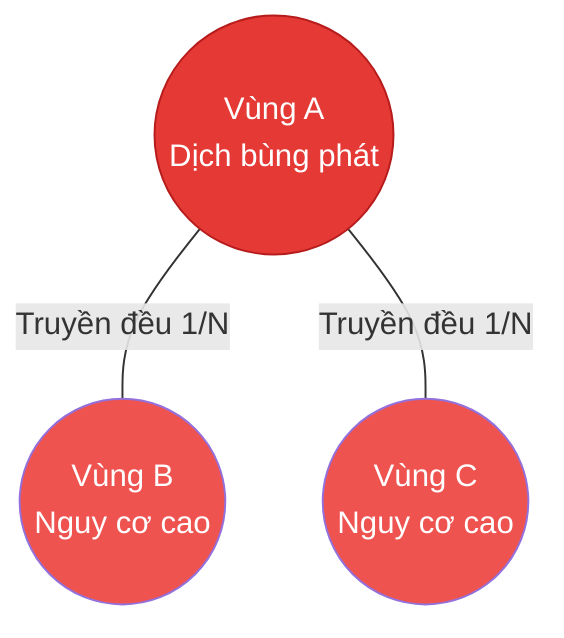
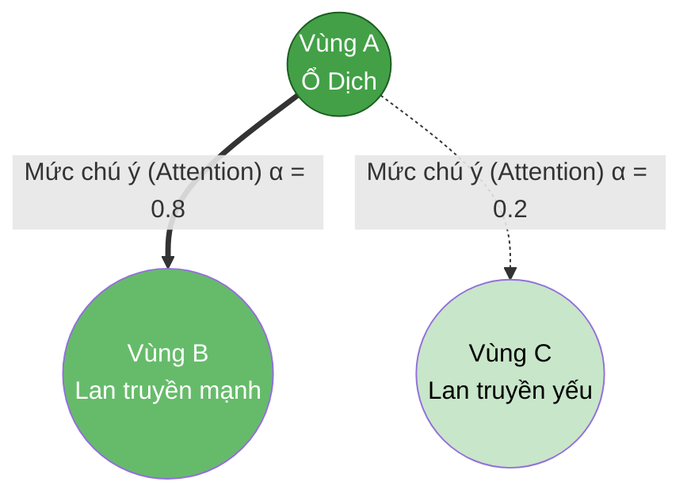
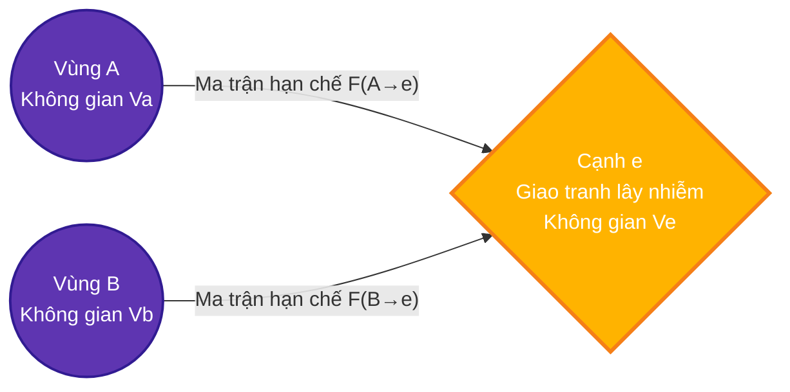
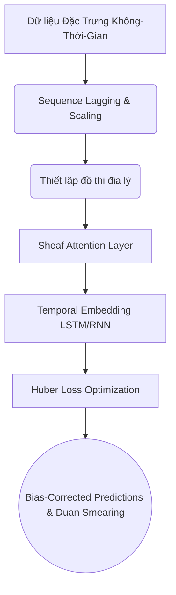

<h1 align="center">🦟 Sheaf Attention Networks in Forecasting Dengue Fever in Brazil</h1>

<div align="center">
  
  
  
</div>

<br>

<div align="center">
  <p><b>A modern geometric deep learning approach to tracking and forecasting episodic outbreaks of Dengue fever across regions in Brazil.</b></p>
</div>

---

## 📖 Overview

Dengue fever remains a critical public health challenge in tropical and subtropical climates, particularly in Brazil. Accurate, localized forecasting of outbreaks is vital for early intervention and resource allocation. This project employs cutting-edge **Graph Neural Networks (GNNs)** combined with **Sheaf Theory** and **Attention Mechanisms** to effectively model complex spatial-temporal epidemiological dynamics.

We demonstrate how topological deep learning can adaptively learn the hidden relationships across geographic boundaries, yielding robust predictions against real-world episodic data.

<br>

## 🧠 Phân tích Trực quan các Kỹ Thuật Graph Neural Networks (GNNs)

Mô hình dự báo sốt xuất huyết này được củng cố bằng việc đánh giá 3 biến thể GNN với độ phức tạp hình học tăng dần, nhằm giải quyết đặc thù **lây lan bệnh dịch không đồng nhất** (heterophilic spread) qua các đường ranh giới địa lý.

### 1. 🌐 Baseline Graph Convolutional Networks (GCN)
`[File: models/gcn_model.py]`

GCN hoạt động như một bộ lọc phổ tĩnh (spectral filter). Nó giả định rằng dịch bệnh lan truyền **giống nhau theo mọi hướng** (Homophily). Trạm thông tin của khu vực A sẽ được truyền đều và mượt (smooth) sang các khu vực lân cận B và C với trọng số ngang bằng nhau.


*Nhược điểm:* Khi giữa A và C có rào cản tự nhiên (núi, sông lớn), GCN vẫn coi tốc độ lây lan là như nhau.

---

### 2. 🎯 Temporal Graph Attention Networks (GAT)
`[File: models/temporal_gat.py]`

GAT tích hợp cấu trúc **Self-Attention** nhằm động lực hóa lưới đồ thị. Chẳng hạn, mạng lưới sẽ tự động học được cơ chế: Vùng A có giao thương mạnh với Vùng B (Đường quốc lộ) nên attention score $\alpha = 0.8$, trong khi Vùng C bị cách trở nên score $\alpha = 0.2$. Điều này cho phép GAT linh hoạt vắt lọc các hàng xóm nguy hiểm nhất.


*Ưu điểm:* Uyển chuyển theo không gian và thời gian.

---

### 3. 🧬 Sheaf Attention Networks (Core Innovation)
`[Files: models/sheaf_model.py & models/sheaf_connection.py]`

Đây là cốt lõi toán học (Algebraic Topology) của dự án. Mạng GNN truyền thống không thể mô hình hóa độ trễ bất đối xứng (A lây cho B nhưng B không lây ngược lại cho A). Bằng cách dùng **Cellular Sheaves**:
- **Không gian Vector (Vector Spaces):** Mỗi vùng và mỗi "cạnh" liên kết vùng được trang bị một Vector Space riêng.
- **Restriction Maps (Bản đồ hạn chế):** Thay vì các tham số vô hướng, mô hình sẽ học các "Ma trận hạn chế" $F(A \to e)$ điều hướng chính xác vector lây lan đi từ vùng A tràn vào cạnh $e$ như thế nào. Giao thức này cho phép điều hướng dòng chảy thông tin cực kì dị cấu tạo (heterophily).


*Sức mạnh:* Xử lý ưu việt hiện tượng lây nhiễm bất đối xứng dựa trên Sheaf Laplacian.

<br>

---

## 🛠️ Architecture & Pipeline



### ✨ Key Implementation Details
- **Micro & Macro Regression**: Simultaneous region-level (micro) and country-level (macro) forecasting.
- **Bias-Correction Mechanisms**: Utilizes **Duan Smearing estimators** and Headroom Clamping to safely reconstruct logarithmic predictions back to the real domain.
- **Evaluation Spectrum**: Detailed logging of `R2_log`, `MAE`, `RMSE`, `SMAPE`, bounded with `ROC_AUC` / `PR_AUC` derived symmetrically from the regression task.

<br>

## 🚀 Getting Started

### 1. Prerequisites
Ensure you have Python 3.9+ and PyTorch installed globally or within a Conda environment.

```bash
# Clone the repository
git clone https://github.com/danielhuynh-04/Sheaf-Attention-Networks-in-forecasting-Dengue-fever-in-Brazil.git
cd Sheaf-Attention-Networks-in-forecasting-Dengue-fever-in-Brazil

# Create environment and install dependencies
pip install torch pandas numpy scikit-learn
```

### 2. Running the Forecasting Model

The main entry point handles training, validation, and testing procedures dynamically.
```bash
python run_global_gat.py --model sheaf_conn --epochs 200
```

**Parameters supported via CLI args:**
- `--model`: Choose the geometric processor (`gat`, `gcn`, `gnn`, `sheaf`, `sheaf_conn`).
- `--epochs`: Number of epochs to train.
- `--eval_only`: `1` disables training and loads the best saved `.pt` checkpoint.
- `--export_predictions`: `1` generates spatial-temporal predictions on a node-level scale (`.csv`).

<br>

## 📊 Evaluation & Reporting

All runtime checkpoints and logs are automatically generated:
1. **Model Checkpoints**: Optimized checkpoints run straight to `checkpoints/<model>_global_best.pt`
2. **Weekly Metrics Tracker**: `data/interim/<model>_global_weekly_report.csv`
3. **Training Log Histories**: `data/interim/<model>_epoch_log.csv`
4. **Summary Stats**: JSON reports on precision/recall bounds across validation and test schemas.

<br>

## 👨‍💻 Author and Contributions

Researched and implemented by **Huynh Le Thanh Hai**.

This repository serves as an academic deep learning endeavor tracking disease vectors algebraically. External contributions are welcome via Pull Requests (PRs). Please ensure topological modifications and derivations are clearly documented in the PR notes.

> **Note**: For privacy bounds and computational size limits, structural data folders (`data/`, `visualizations/`, `checkpoints/`) have been ignored from this public repository index. Users should reconstruct the dataset vectors locally into `data/`.
