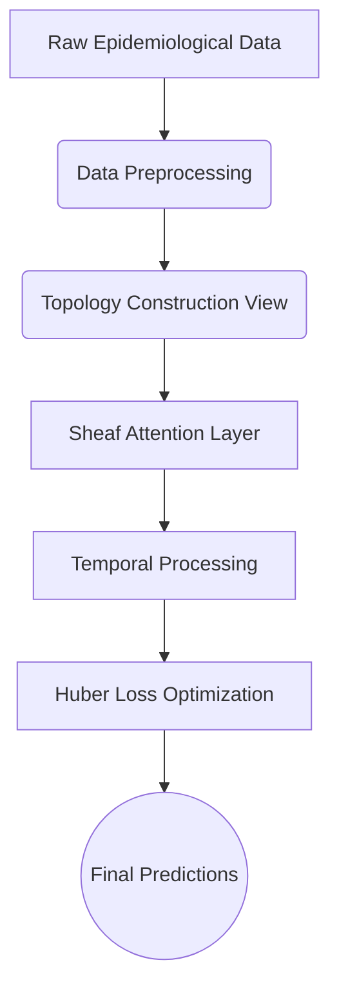

<h1 align="center">🦟 Sheaf Attention Networks in Forecasting Dengue Fever in Brazil</h1>

<div align="center">
  
  
  
</div>

<br>

<div align="center">
  <p><b>A modern Graph Neural Network approach to tracking and forecasting episodic outbreaks of Dengue fever across regions in Brazil.</b></p>
</div>

---

## 📖 Overview

Dengue fever remains a critical public health challenge in tropical and subtropical climates, particularly in Brazil. Accurate, localized forecasting of outbreaks is vital for early intervention and resource allocation. This project employs cutting-edge **Graph Neural Networks (GNNs)** combined with **Sheaf Theory** and **Attention Mechanisms** to effectively model complex spatial-temporal epidemiological dynamics.

We demonstrate how topological deep learning can adaptively learn the hidden relationships across geographic boundaries, yielding robust predictions against real-world episodic data.

### ✨ Key Features

- **Advanced GNN Architecture**: Incorporates **Sheaf Attentional** patterns to capture local and global geometric structure explicitly.
- **Micro & Macro Regression**: Weekly node-level predictions with extensive bias-correction steps (Duan Smearing & Headroom Clamping).
- **Comprehensive Evaluation**: Metrics encompassing `R2_log`, `MAE`, `RMSE`, and classification thresholds (`ROC_AUC`, `PR_AUC`).
- **Flexible Pipeline**: Built on PyTorch, ready for both CPU validation and GPU heavy-lifting.

---

## 🛠️ Architecture & Pipeline



The model architecture revolves around multiple implementations accessible in `models/`:
- `SheafTemporal` (in `sheaf_model.py`)
- `GAT`, `GCN`, and basic `GNN` baselines

<br>

## 🚀 Getting Started

### 1. Prerequisites

Ensure you have Python 3.9+ and PyTorch installed. Alternatively, you can use Conda:

```bash
# Clone the repository
git clone https://github.com/danielhuynh-04/Sheaf-Attention-Networks-in-forecasting-Dengue-fever-in-Brazil.git
cd Sheaf-Attention-Networks-in-forecasting-Dengue-fever-in-Brazil

# Create environment and install dependencies
pip install -r requirements.txt
```
*(If `requirements.txt` is missing, standard installations of `torch`, `pandas`, `numpy`, and `scikit-learn` are required).*

### 2. Running Global GAT / Sheaf Model

To perform a full training, validation, and testing procedure over all weekly snapshots, simply execute:

```bash
python run_global_gat.py --model gat --epochs 200
```

**Parameters supported via CLI args:**
- `--model`: Choice of `gat`, `gcn`, `gnn`, `sheaf`, `sheaf_conn`.
- `--epochs`: Number of epochs to train.
- `--eval_only`: Disables training, loads the best `.pt` file checkpoint.
- `--export_predictions`: Generates spatial-temporal metrics on a node-level (`.csv` export).

Example for **Sheaf**:
```bash
python run_global_gat.py --model sheaf_conn --epochs 150 --export_predictions 1
```

---

## 📊 Evaluation & Reporting

All running outputs are tracked sequentially.
1. **Model Checkpoints**: Best checkpoints are saved to `checkpoints/`
2. **Weekly Metrics**: `data/interim/<model>_global_weekly_report.csv`
3. **Training Logs**: `data/interim/<model>_epoch_log.csv`
4. **Summary Stats**: A `JSON` summary file aggregating micro and macro stats can be found in `data/interim/` directory as well.

---

## 👨‍💻 Author and Contributions

Built and researched by **Huynh Le Thanh Hai**.

This project forms part of an organized academic research endeavor. External contributions are welcome. Please fork the repository and propose changes through Pull Requests (PRs). Ensure all mathematical proofs and topological structure changes are thoroughly documented in PR descriptions.

<br>

> **Note**: For privacy and file-size constraints, the `data/`, `visualizations/`, `checkpoints/`, and proprietary documentation formats (`.docx`, `.pdf`) have been excluded from this public repository. All necessary dummy structures or open datasets should be reconstructed by the user into the `data/` folder directory.
