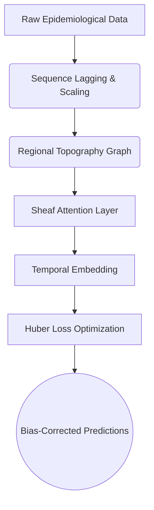

<h1 align="center">🦟 Sheaf Attention Networks in Forecasting Dengue Fever in Brazil</h1>

<div align="center">
  
  
  
</div>

<br>

<div align="center">
  <p><b>A modern geometric deep learning approach to tracking and forecasting episodic outbreaks of Dengue fever across regions in Brazil.</b></p>
</div>

---

## 📖 Overview

Dengue fever remains a critical public health challenge in tropical and subtropical climates, particularly in Brazil. Accurate, localized forecasting of outbreaks is vital for early intervention and resource allocation. This project employs cutting-edge **Graph Neural Networks (GNNs)** combined with **Sheaf Theory** and **Attention Mechanisms** to effectively model complex spatial-temporal epidemiological dynamics.

We demonstrate how topological deep learning can adaptively learn the hidden relationships across geographic boundaries, yielding robust predictions against real-world episodic data.

<br>

## 🧠 Graph Neural Network Techniques

Our methodology evaluates multiple graph architectures to address the spatial-temporal complexity of epidemic propagation:

### 1. 🧬 Sheaf Attention Networks (Core Innovation)
Traditional GNNs assume uniform smoothing (homophily) across neighbors. However, disease spread is highly heterogeneous due to factors like geographical barriers, climate variants, and transportation networks. 
We employ **Cellular Sheaves**—a mathematical construct from algebraic topology:
- **Sheaf Laplacian**: Instead of a standard graph Laplacian, we construct a Sheaf Laplacian that dictates how feature spaces at one node translate to its neighbors.
- **Learnable Restriction Maps**: For each geographic edge, the model utilizes an MLP to learn restriction matrices, explicitly capturing directional and asymmetric outbreak propagation.

### 2. 🎯 Graph Attention Networks (GAT)
Using masked self-attention over geographic adjacencies, the Temporal GAT dynamically evaluates the varying importance of neighboring regions. This allows the model to flexibly weigh which adjacent micro-regions contribute most to localized outbreaks week over week.

### 3. 🌐 Graph Convolutional Networks (GCN)
A robust baseline that acts as a spectral filter on the geography graph, smoothing lagged epidemiological and climate features across interconnected municipalities.

---

## 🛠️ Architecture & Pipeline



### ✨ Key Implementation Details
- **Micro & Macro Regression**: Simultaneous region-level (micro) and country-level (macro) forecasting.
- **Bias-Correction Mechanisms**: Utilizes **Duan Smearing estimators** and Headroom Clamping to safely reconstruct logarithmic predictions back to the real domain.
- **Evaluation Spectrum**: Detailed logging of `R2_log`, `MAE`, `RMSE`, `SMAPE`, bounded with `ROC_AUC` / `PR_AUC` derived symmetrically from the regression task.

<br>

## 🚀 Getting Started

### 1. Prerequisites
Ensure you have Python 3.9+ and PyTorch installed globally or within a Conda environment.

```bash
# Clone the repository
git clone https://github.com/danielhuynh-04/Sheaf-Attention-Networks-in-forecasting-Dengue-fever-in-Brazil.git
cd Sheaf-Attention-Networks-in-forecasting-Dengue-fever-in-Brazil

# Create environment and install dependencies
pip install torch pandas numpy scikit-learn
```

### 2. Running the Forecasting Model

The main entry point handles training, validation, and testing procedures dynamically.
```bash
python run_global_gat.py --model sheaf_conn --epochs 200
```

**Parameters supported via CLI args:**
- `--model`: Choose the geometric processor (`gat`, `gcn`, `gnn`, `sheaf`, `sheaf_conn`).
- `--epochs`: Number of epochs to train.
- `--eval_only`: `1` disables training and loads the best saved `.pt` checkpoint.
- `--export_predictions`: `1` generates spatial-temporal predictions on a node-level scale (`.csv`).

<br>

## 📊 Evaluation & Reporting

All runtime checkpoints and logs are automatically generated:
1. **Model Checkpoints**: Optimized checkpoints run straight to `checkpoints/<model>_global_best.pt`
2. **Weekly Metrics Tracker**: `data/interim/<model>_global_weekly_report.csv`
3. **Training Log Histories**: `data/interim/<model>_epoch_log.csv`
4. **Summary Stats**: JSON reports on precision/recall bounds across validation and test schemas.

<br>

## 👨‍💻 Author and Contributions

Researched and implemented by **Huynh Le Thanh Hai**.

This repository serves as an academic deep learning endeavor tracking disease vectors algebraically. External contributions are welcome via Pull Requests (PRs). Please ensure topological modifications and derivations are clearly documented in the PR notes.

> **Note**: For privacy bounds and computational size limits, structural data folders (`data/`, `visualizations/`, `checkpoints/`) have been ignored from this public repository index. Users should reconstruct the dataset vectors locally into `data/`.
